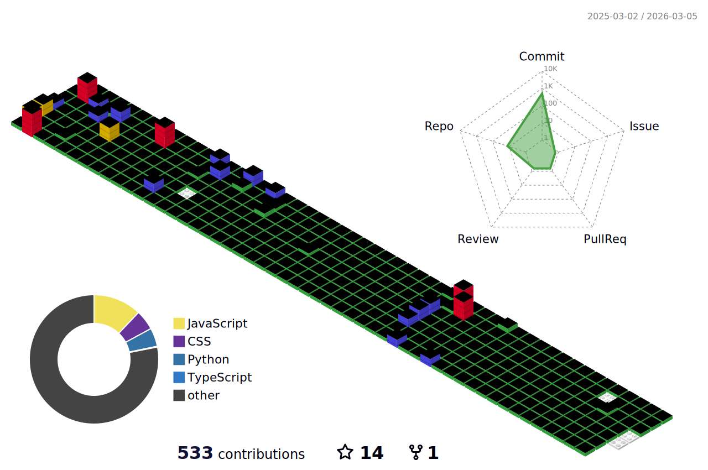

<!-- <div align="center">
  
</div> -->

<h3 align="center">Hi there 👋</h3>

<br />

<div align="center">

  [](https://github-readme-stats.vercel.app/api?username=devhaaana\&count_private=true\&hide=issues,contribs\&show_icons=true\&theme=radical#gh-dark-mode-only)
[](https://github-readme-stats.vercel.app/api?username=devhaaana\&count_private=true\&hide=issues,contribs\&show_icons=true\&theme=flag-india#gh-light-mode-only)
  [](https://github-readme-stats.vercel.app/api/top-langs/?username=devhaaana\&count_private=true\&layout=compact\&theme=radical#gh-dark-mode-only)
[](https://github-readme-stats.vercel.app/api/top-langs/?username=devhaaana\&count_private=true\&layout=compact\&theme=flag-india#gh-light-mode-only)

</div>

<br />

<div align="center">
  
<!--START_SECTION:waka-->
**I'm a Night 🦉** 

```text
🌞 Morning                23 commits          █░░░░░░░░░░░░░░░░░░░░░░░░   02.80 % 
🌆 Daytime                143 commits         ████░░░░░░░░░░░░░░░░░░░░░   17.44 % 
🌃 Evening                200 commits         ██████░░░░░░░░░░░░░░░░░░░   24.39 % 
🌙 Night                  454 commits         ██████████████░░░░░░░░░░░   55.37 % 
```


📊 **This Week I Spent My Time On** 

```text
🕑︎ Time Zone: Asia/Seoul

💬 Programming Languages: 
No Activity Tracked This Week

🔥 Editors: 
No Activity Tracked This Week

💻 Operating System: 
No Activity Tracked This Week
```


 Last Updated on 27/01/2026 19:01:54 UTC
<!--END_SECTION:waka-->

</div>

<!-- <br /> -->

<!-- <div align="center">
<picture>
  <source
    srcset="./profile-3d-contrib/profile-night-rainbow.svg"
    media="(prefers-color-scheme: dark)"
  />
  <source
    srcset="./profile-3d-contrib/profile-gitblock.svg"
    media="(prefers-color-scheme: light), (prefers-color-scheme: no-preference)"
  />
  
</picture>
</div> -->

<!--    -->
<!--    -->

<!-- <br /> -->

<!-- <h3 align="center">✨ Tech Stack ✨</h3>
<div align="center">
  &nbsp
  
  
  
</div>

<div align="center">
  
  
  
</div>

<div align="center">
  
  
  
  
</div>
  
<div align="center">
  
  
  
</div>

<br />

<h3 align="center">🛠 Tools 🛠</h3>
<div align="center">
  
  
</div>

<div align="center">
  
  
  
</div>

<br />

<!-- <br /> -->

<!-- <div align="center">
  
</div> -->

