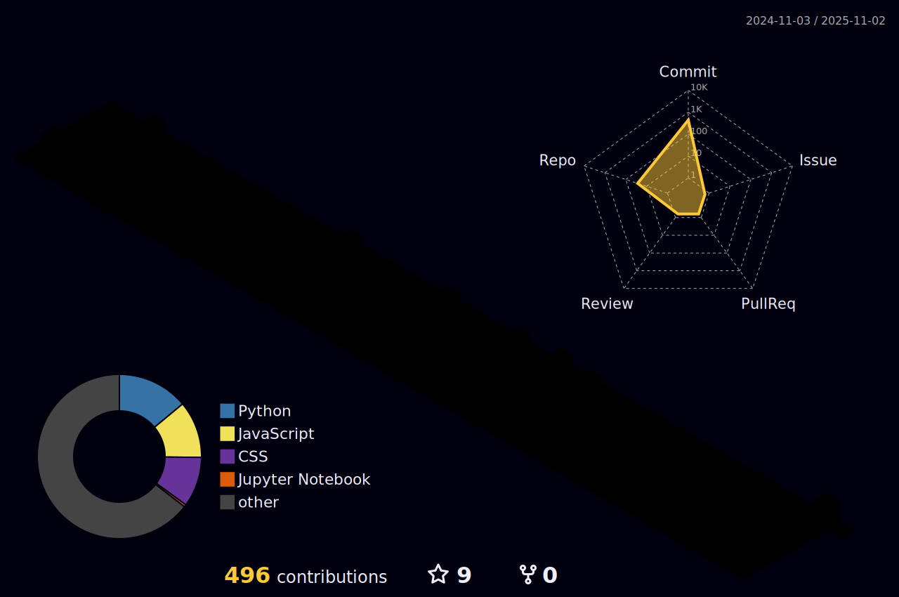

<div align="center">
  
</div>

<h3 align="center">Hi there 👋</h3>

<br />

<div align="center">


</div>

<br />

<div align="center">
  


</div>

<br />

<div align="center">
  
<!--START_SECTION:waka-->
**I'm a Night 🦉** 

```text
🌞 Morning                23 commits          █░░░░░░░░░░░░░░░░░░░░░░░░   05.85 % 
🌆 Daytime                122 commits         ████████░░░░░░░░░░░░░░░░░   31.04 % 
🌃 Evening                153 commits         ██████████░░░░░░░░░░░░░░░   38.93 % 
🌙 Night                  95 commits          ██████░░░░░░░░░░░░░░░░░░░   24.17 % 
```


📊 **This Week I Spent My Time On** 

```text
🕑︎ Time Zone: Asia/Seoul

💬 Programming Languages: 
No Activity Tracked This Week

🔥 Editors: 
No Activity Tracked This Week

💻 Operating System: 
No Activity Tracked This Week
```


 Last Updated on 10/03/2025 09:48:17 UTC
<!--END_SECTION:waka-->

</div>

<br />

<div align="center">
  
</div>

<br />

<!--    -->
<!--    -->

<br />

<h3 align="center">✨ Tech Stack ✨</h3>
<div align="center">
  &nbsp
  
  
  
</div>

<div align="center">
  
  
  
</div>

<div align="center">
  
  
  
  
</div>
  
<div align="center">
  
  
  
</div>

<br />

<h3 align="center">🛠 Tools 🛠</h3>
<div align="center">
  
  
  
</div>

<div align="center">
  
  
  
</div>

<br />

<h3 align="center">📫 Contact 📫</h3>
<div align="center">
  <a href="https://velog.io/@one4435" target="_blank">
    
  </a>
  <a href="mailto:one4435go@gmail.com" target="_blank">
    
  </a>
</div>

<br />

<div align="center">
  <a href="https://hits.seeyoufarm.com" target="_blank">
    </a>
  </a>
</div>

<br />


<div align="center">
  
</div>

